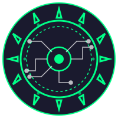

<p align="center">
  
</p>

# ucblib -- Bowflex VeloCore Bike Data Library

Java/Android library for reading real-time sensor data from Bowflex VeloCore C9/C10 exercise bikes. Provides full control of the UCB (Universal Control Board) serial protocol including sensor streaming, resistance control, and incline adjustment.

## Background

The Bowflex VeloCore bikes run Android 9 on a Rockchip SoC. The bike's sensors (resistance, RPM, power, tilt) are managed by the UCB, a microcontroller connected via serial at `/dev/ttyS4` (230400 baud). In the stock firmware, `nautiluslauncher` (a system app) opens the serial port and exposes it as a TCP server on `localhost:9999`. The JRNY workout app connects to this TCP server to receive sensor data.

The stock system locks users into the JRNY kiosk. After jailbreaking, `nautiluslauncher` is disabled and replaced by `SerialBridge` -- a platform-signed system app that opens `/dev/ttyS4` directly and serves the same TCP:9999 interface. This library connects to that bridge and handles the full UCB protocol, allowing any app to read bike data and control resistance without JRNY.

## Architecture

```
UCB Hardware (/dev/ttyS4, 230400 baud)
    |
SerialBridge (system app, uid 1000, platform-signed)
    |
TCP:9999 (localhost, single-client)
    |
UcbDirectClient (this library)
    |
Your App (BikeArcade, custom workout app, etc.)
```

TCP:9999 only serves one client at a time. The library provides `pause()`/`resume()` for cooperative access -- apps should `pause()` when backgrounded to free the port for other apps, and `resume()` when foregrounded to reconnect.

## Quick Start

```java
UcbDirectClient client = new UcbDirectClient();
client.addListener(new UcbDirectClient.ListenerAdapter() {
    @Override
    public void onSensorData(SensorData d) {
        Log.d("Bike", d.power + "W " + d.rpm + "RPM res=" + d.resistanceLevel);
    }

    @Override
    public void onLeanUpdate(float leanDegrees, int rawX, int rawY, int rawZ) {
        steerCharacter(leanDegrees);
    }
});
client.connectAsync();

// App goes to background -- release the serial bridge
client.pause();

// App returns to foreground -- reconnect
client.resume();

// Done
client.disconnect();
```

## What the Library Handles

`UcbDirectClient.connectAsync()` performs the full UCB protocol sequence:

1. Connects to TCP:9999 (SerialBridge)
2. Sends SYSTEM_DATA init requests (5x, identifies hardware)
3. Sends STREAMING_CONTROL to enable sensor streaming
4. Starts heartbeat thread (every 3 seconds, keeps UCB alive)
5. Reads and decodes STREAM_NTFCN frames with sensor data
6. Auto-reconnects on connection loss (with 3-second backoff)

Apps don't need to understand the UCB wire protocol -- just listen for `onSensorData()` callbacks.

## Data Available

### SensorData (from UCB stream notifications, ~1 Hz)

| Field | Type | Endianness | Description |
|-------|------|------------|-------------|
| `resistanceLevel` | int | Big-endian | Current resistance level (1-100) |
| `rpm` | int | Big-endian | Pedal RPM |
| `tilt` | int | Big-endian | VeloCore pivot tilt value |
| `power` | float | Little-endian | Power in watts (computed by UCB firmware) |
| `crankRevCount` | long | Big-endian | Cumulative crank revolutions |
| `crankEventTime` | int | Big-endian | Last crank event timestamp (ms) |
| `error` | int | -- | Error code (0 = OK) |

### WorkoutData (JRNY's 51-byte WORKOUT_BLE_DATA payload)

| Field | Type | Description |
|-------|------|-------------|
| `power` | float | Current power in watts |
| `avgPower` | float | Average power in watts |
| `speedMph` | float | Current speed in mph |
| `distance` | float | Total distance in miles |
| `cadence` | float | Current cadence in RPM |
| `calories` | float | Total calories burned |
| `elapsedTime` | float | Workout time in seconds |
| `resistanceLevel` | int | Resistance level (1-100) |

### LeanSensor (continuous, ~50 Hz from accelerometer)

| Value | Description |
|-------|-------------|
| `leanDegrees` | Lean angle: positive = right, negative = left |
| `rawX/Y/Z` | Raw accelerometer values from `/dev/input/event2` |

The gsensor at `/dev/input/event2` is world-readable (666 permissions). No special permissions required.

## Commands

```java
// Set resistance (1-100)
client.setResistance(25);

// Set incline
client.setIncline(5);

// Send any raw UCB command
client.sendCommand(UcbMessageIds.STREAMING_CONTROL, new byte[]{0x01, 0x00});
```

## Lifecycle Management

TCP:9999 only supports one client. Apps must cooperate:

```java
// In your Activity or ViewModel:

// App foregrounded -- claim the serial bridge
client.resume();

// App backgrounded -- release for other apps
client.pause();
```

When paused, the client disconnects from TCP:9999 and stops heartbeats. The UCB will drop back to idle. When resumed, the client reconnects and re-runs the full init sequence.

If another app connects while yours is paused, it gets the port. When your app resumes, the other app's connection gets kicked (SerialBridge is last-in-wins). The other app should detect this via `onConnectionChanged(false, ...)` and not fight to reconnect if it's backgrounded.

## UCB Protocol Reference

The UCB communicates over serial at 230400 baud. SerialBridge bridges this to TCP:9999.

### Wire Format

```
STX(0x02) + hex_ascii_encode(payload + CRC32_BE) + ETX(0x03)
```

- Payload: `[msgType:1] [msgId:1] [counter:1] [data:N]`
- CRC32: standard init 0xFFFFFFFF, final XOR undone (`crc.getValue() ^ 0xFFFFFFFFL`), big-endian bytes
- Hex encoding: uppercase ASCII (`0x02 0x1F 0x01` becomes `"021F01"`)
- Message types: 0x00=ACK, 0x01=request, 0x02=response/notification

### Message IDs

| ID | Name | Direction | Description |
|----|------|-----------|-------------|
| 0x07 | STREAMING_CONTROL | App -> UCB | Enable/disable sensor streaming |
| 0x08 | STREAM_NTFCN | UCB -> App | Sensor data notification (23 bytes) |
| 0x09 | SET_RESISTANCE | App -> UCB | Set resistance level |
| 0x0A | SET_INCLINE | App -> UCB | Set incline level |
| 0x18 | SYSTEM_DATA | Bidirectional | Hardware identification |
| 0x1F | SYSTEM_HEART_BEAT | Bidirectional | Keep-alive (every 3 seconds) |
| 0x31 | WORKOUT_BLE_DATA | App -> UCB | JRNY workout telemetry (51 bytes) |
| 0x3D | SET_WORKOUT_STATE | App -> UCB | Set workout state (1 byte: 0=stopped, 1=running, 2=paused) |

### UCB Firmware States

The heartbeat response includes the current firmware state:

| Value | State | Description |
|-------|-------|-------------|
| 0 | BOOT_FAILSAFE | Recovery mode |
| 1-3 | POWER_ON_0/1/2 | Boot sequence |
| 8 | SELECTION | Idle, waiting for workout |
| 9 | WORKOUT | Active workout, streaming enabled |
| 10 | SLEEP | Low power mode |

Sensor streaming only produces data when the UCB is in WORKOUT state. The init sequence (SYSTEM_DATA requests x5, then STREAMING_CONTROL enable) transitions the UCB from SELECTION to WORKOUT. JRNY also sends SET_WORKOUT_STATE with payload 0x01 (NLS_WORKOUT_RUNNING) to explicitly transition, but the SYSTEM_DATA init sequence achieves the same result.

See `UcbMessageIds.java` for the complete list of message types.

## Building

```bash
./build.sh
```

Produces `build/ucblib.jar`. Add to your Android project's classpath.

### Latest release

```bash
curl -L -o ucblib.jar https://github.com/ril3y/ucblib/releases/latest/download/ucblib.jar
```

### Using in a Gradle project

```kotlin
dependencies {
    implementation(files("libs/ucblib.jar"))
}
```

## Testing

```bash
./build.sh
javac -classpath build/ucblib.jar -d build/test test/UcbFrameTest.java
java -classpath "build/ucblib.jar:build/test" UcbFrameTest
```

Tests run on desktop JVM (no Android device needed). CI runs automatically on push to master.

## Hardware Details

- **Console**: Bowflex VeloCore C9/C10, Android 9, Rockchip SoC, 2GB RAM
- **UCB**: v5.87.5-RTH build 36, hardware variant 87
- **Serial**: `/dev/ttyS4` at 230400 baud, owned by root:system
- **Kernel**: Linux 4.4.x
- **Accelerometer**: `/dev/input/event2`, world-readable

## License

MIT

## Credits

Reverse engineered from Bowflex JRNY firmware v2.25.1 on VeloCore C9/C10.
Protocol decoded from decompiled APKs and verified against live serial captures.
